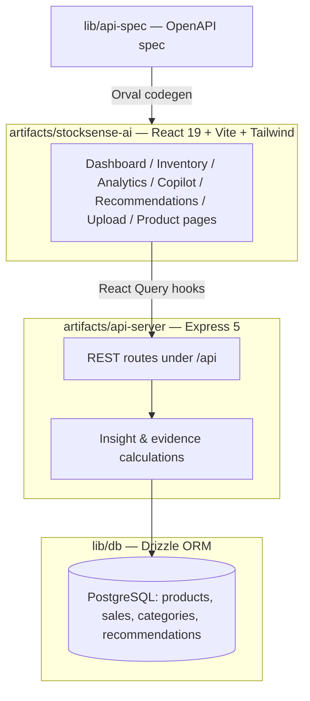

The 30-day average sales figure moves slightly day to day (the demo data has built-in weekday/weekend and week-over-week variance), so exact numbers on the live demo may differ a little from the moment you read this — but the *formula* shown above is exactly what's running in production, not a mocked example.

This transparency is why the copilot shows **facts → calculation → conclusion → recommendation → assumption** for every answer instead of a bare suggestion.

---

## 📦 Inventory Intelligence — the actual formulas

| Metric | Formula (from `lib/stocksense.ts`) |
|---|---|
| **Average daily sales** | Units sold in the last 30 days ÷ 30 |
| **Days remaining** | Current stock ÷ average daily sales |
| **Sales growth %** | (units in last 30 days − units in prior 30 days) ÷ units in prior 30 days × 100 |
| **Status: CRITICAL** | Days remaining < supplier lead time |
| **Status: LOW** | Days remaining ≤ supplier lead time + 3 |
| **Status: OVERSTOCK** | Days remaining > 60 |
| **Status: DECLINING** | Growth < −15% (and not already Critical/Low/Overstock) |
| **Status: HEALTHY** | None of the above |
| **Reorder quantity** | `(supplier lead time × daily sales) + (2 days × daily sales safety stock) − current stock`, rounded up to the nearest 10-unit case |

## 📈 Sales Analytics

The Analytics page (`/analytics`) shows, for a selectable period:

- Total revenue and units sold, with period-over-period growth %
- A daily sales series chart
- Revenue broken down by category
- Top 6 and bottom 6 products by units sold

## 🧭 Recommendation Engine

The `/recommendations` page groups every product into three buckets, each generated from the same insight calculation:

| Bucket | Contains |
|---|---|
| **Act now** | `CRITICAL` products |
| **Monitor** | `LOW`, `OVERSTOCK`, and `DECLINING` products |
| **No action needed** | `HEALTHY` products (first 8 shown) |

Each card shows the problem, the evidence line, the calculation, and — for products that need reordering — the exact reorder quantity. There is no forecasting model here: reorder math is a programmatic formula (lead-time demand + safety stock), not a prediction.

---

## 🖥️ Application Screens

| Route | Screen |
|---|---|
| `/` | Executive dashboard — health score, trend chart, top/slow movers, attention feed |
| `/inventory` | Searchable, filterable, sortable inventory table |
| `/analytics` | Revenue, units, growth, category split, top/bottom products |
| `/copilot` | Ask StockSense — natural-language Q&A with evidence panel |
| `/recommendations` | Act now / Monitor / No action needed, grouped |
| `/upload` | CSV import for inventory & sales, plus one-click demo store loading |
| `/products/:id` | Single product record — sales trend, stock facts, recommendation, evidence drawer |

---

## 🏛️ Architecture



- The frontend never hand-writes fetch calls — API hooks and Zod types are generated from `lib/api-spec/openapi.yaml` via Orval into `lib/api-client-react` and `lib/api-zod`.
- All business math (insights, evidence, reorder quantities) lives server-side in `artifacts/api-server/src/lib/stocksense.ts` and is exposed through `artifacts/api-server/src/routes/stocksense.ts`.

## 🧱 Tech Stack

| Layer | Technology |
|---|---|
| Frontend | React 19, Vite, TypeScript, Wouter (routing) |
| Styling | Tailwind CSS, Radix UI primitives, shadcn-style components, Framer Motion, Recharts |
| Backend | Node.js 24, Express 5, Pino (logging) |
| Database | PostgreSQL, Drizzle ORM |
| Validation / Contract | Zod, OpenAPI (`lib/api-spec`), Orval codegen |
| AI / NLU | In-process rule-based query interpreter (no external LLM/ML provider) |
| Monorepo | pnpm workspaces |
| Deployment | Replit (autoscale deployment) |

---

## 📁 Project Structure

```text
StockSense-AI/
├── artifacts/
│   ├── stocksense-ai/        # React frontend
│   │   └── src/
│   │       ├── App.tsx       # All routed pages & UI
│   │       ├── index.css     # Theme + motion utilities
│   │       └── components/   # shadcn-style UI primitives
│   ├── api-server/           # Express backend
│   │   └── src/
│   │       ├── lib/stocksense.ts     # Demo seeding, insights, evidence
│   │       ├── routes/stocksense.ts  # Dashboard/inventory/analytics/copilot/upload routes
│   │       └── app.ts
│   └── mockup-sandbox/       # Internal Replit design-preview tooling (not user-facing)
├── lib/
│   ├── db/                   # Drizzle schema (products, sales, categories, recommendations)
│   ├── api-spec/             # OpenAPI contract (source of truth)
│   ├── api-zod/              # Generated Zod schemas
│   └── api-client-react/     # Generated React Query hooks
├── scripts/
├── package.json
├── pnpm-workspace.yaml
├── .replit                   # Replit deployment config
└── README.md
```

---

## ⚙️ Installation

```bash
# 1. Clone the repository
git clone https://github.com/Arasukumars007/StockSense-AI.git
cd StockSense-AI

# 2. Install dependencies (pnpm is required — the workspace blocks npm/yarn)
pnpm install

# 3. Configure environment variables (see below)

# 4. Push the database schema
pnpm --filter @workspace/db run push

# 5. Start the API server (dev mode)
pnpm --filter @workspace/api-server run dev

# In a separate terminal, start the frontend
pnpm --filter @workspace/stocksense-ai run dev
```

Other useful scripts:

```bash
pnpm run typecheck    # Full typecheck across all packages
pnpm run build        # Typecheck + build all packages
pnpm --filter @workspace/api-spec run codegen   # Regenerate API hooks/schemas from the OpenAPI spec
```

## 🔑 Environment Variables

| Variable | Purpose |
|---|---|
| `DATABASE_URL` | PostgreSQL connection string (required — the server throws on startup without it) |
| `LOG_LEVEL` | Optional Pino log level (defaults to `info`) |

No AI provider API key is required — the copilot does not call an external model.

## 📄 Data Format (CSV Import)

**Inventory CSV** — columns read by the import endpoint:

```csv
product_id,product_name,category,price,current_stock,daily_sales,supplier_lead_time
```

**Sales CSV**:

```csv
product_id,date,units_sold,revenue
```

`date` must be in `YYYY-MM-DD` format. Invalid or missing required fields are skipped and reported back as row-level errors rather than failing the whole import.

---

## 🎬 Hackathon Demo Flow

1. Open the [Live Demo](https://stock-sense-ai--asuraa14375.replit.app)
2. Land on the **Dashboard** — point out the health score and the attention feed
3. Click into an item flagged `CRITICAL` (e.g. Wireless Mouse) via the attention feed
4. On the **Product page**, show the sales trend chart and the stock facts
5. Click **Show evidence** to reveal the exact calculation behind the status
6. Open **AI Copilot** and ask "What should I reorder today?"
7. Point out that the answer's numbers match what's on the Product page — nothing is re-invented
8. Open **Recommendations** and show the Act now / Monitor / No action grouping
9. Open **Upload** and show CSV import + one-click demo store loading
10. Close with the business impact: faster, explainable restocking decisions instead of manual spreadsheet scanning

---

## 🆚 Why StockSense AI?

| Traditional dashboard | StockSense AI |
|---|---|
| Shows the data | Explains what the data means |
| Requires manual interpretation | Ranks what needs attention, and why |
| A generic AI chatbot may answer confidently without grounding | Every copilot answer is tied to the same server-calculated facts shown elsewhere in the app |

---

## 📊 Business Impact

- Faster identification of stock-out risk before it becomes a lost sale
- Less cash tied up in slow-moving overstock
- Declining products surfaced automatically instead of discovered late
- A copilot answer a manager can actually verify, because the math is shown alongside it

## 🛡️ Explainable-by-Design

- Business facts (stock, sales, growth) are calculated once, server-side, from the database
- The copilot only *formats* those facts — it does not generate or guess numbers
- Every recommendation and copilot answer displays its calculation
- Assumptions (e.g. "demand remains similar to the last 30 days") are stated explicitly rather than hidden

---

## 🧪 Testing

There are currently no automated test files in this repository. Quality is enforced via:

- `pnpm run typecheck` — TypeScript strict typechecking across the whole workspace
- Zod validation at every API boundary (requests and responses)

Automated tests are a good next contribution, not something currently claimed.

## ☁️ Deployment

Live on Replit's autoscale deployment: **[stock-sense-ai--asuraa14375.replit.app](https://stock-sense-ai--asuraa14375.replit.app)**

Deployment is configured in `.replit`:
- Runtime: Node.js 24 + PostgreSQL 16 (Replit modules)
- `deploymentTarget = "autoscale"`, routed as an application
- Production build runs `pnpm --filter @workspace/api-server run build`, then starts `artifacts/api-server/dist/index.mjs`
- Health check: `GET /api/healthz`

---

## 🗺️ Future Roadmap

> Everything below is a **planned idea**, not existing functionality.

- 🔮 Real demand forecasting (currently the app uses rolling averages, not predictive ML)
- 🏬 Multi-store / multi-location support
- 🚚 Supplier performance tracking
- 🤝 Automated purchase-order generation
- 🔐 Role-based access control
- 📱 A dedicated mobile app
- 🧠 Optional integration with an actual LLM provider for more open-ended copilot questions

---

## 👥 Team

- Add team member names here

## 📜 License

`package.json` declares **MIT**, but no `LICENSE` file is currently present in the repository — add one to make this enforceable.

---

<div align="center">


</div>
